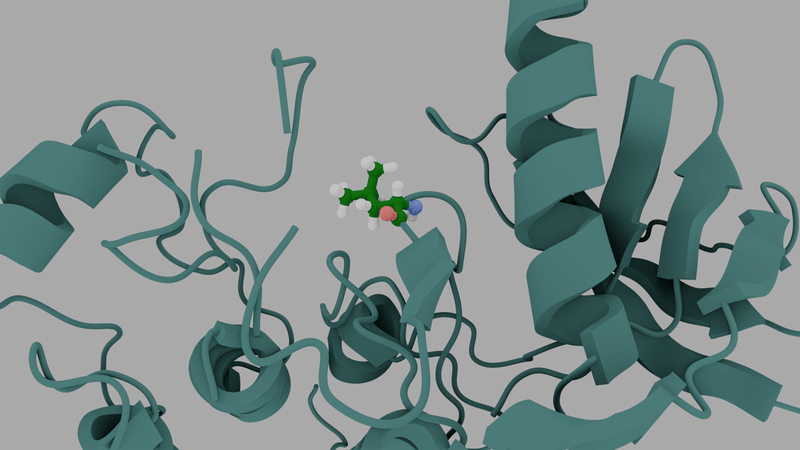
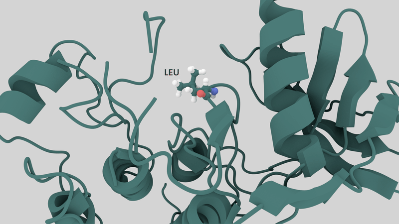

# renders
A collection of renders I did for scientific and non-scientific purposes with several tools, mostly [Blender](https://www.blender.org/), [ChimeraX](https://www.rbvi.ucsf.edu/chimerax/), [VMD](https://www.ks.uiuc.edu/Research/vmd/), and [python](https://www.python.org/).

## Folding of TRP-cage
The animations here are are related to [this](https://doi.org/10.1021/acs.jpclett.5c02079) publication, where we explored the free energy landscape of folding of small proteins with [OneOPES](https://doi.org/10.1021/acs.jctc.3c00254). Done with Blender and ChimeraX.

  <kbd>
    
  </kbd>
   
  <em>Representation of the free energy landscape of TRP-cage, a mini-protein, and the main structures found in the corresponding minima.</em>

 

  <kbd>
     
  </kbd>
   
  <em>Representation of OneOPES sampling protein conformations, the enhanced sampling method used to explore the free energy landscape of TRP-cage.</em>

## Activation of ADRB1 in path space
The animation is related to [this](https://doi.org/10.1021/acs.jpclett.5c03834) publication, where we explored the free energy landscape of activation of class A GPCRs with a path-like method.

  <kbd>
    
  </kbd>
   
  <em>Representation of the free energy landscape of the mu-opioid receptor sampled with a path CV.</em>

## Sampling of MEK1/ERK2 kinase complex

These are two videos on the MEK1/ERK2 kinase complex, a work we are now [publishing](https://doi.org/10.64898/2026.01.19.700303). These are two snippets of a set of very long simulations that I did for the thesis defense of the first author of the manuscript. Done with ChimeraX.

  <kbd>
    
  </kbd>
     
  <em>Dynamics of the MEK1/ERK2 complex with a focus on the HIS-HIS interaction at the interface.</em>

 

  <kbd>
     
  </kbd>
   
  <em>Dynamics of the MEK1/ERK2 complex with a focus on a phosphorylation-compatible distance of the TxY motiv in ERK2 from the ATP in the binding site of MEK1.</em>

## Host-Guest system

A short animation I did on a host-guest system sampled by OneOPES (represented by the concentric rings) for a coworker of mine, from [this](https://doi.org/10.1021/acs.jctc.4c01112) work. Done with Blender.

  <kbd>
     
  </kbd>
   
  <em>Host-Guest system in a bound state. Simple animation of short dynamics.</em>

## Beta-adrenergic-1 GPCR activation

This animation comes from [this](https://doi.org/10.1021/acs.jpclett.5c02079) publication, where we explored the free energy landscape of activation of a class A GPCR with [OneOPES](https://doi.org/10.1021/acs.jctc.3c00254). Done with Blender.

  <kbd>
     
  </kbd>
   
  <em>Activation of ADRB1, a class A GPCR, a family of membrane protein that transduce signals across membrane. The light moving is a sodium ion reaching a sodium binding spot.</em>

## Point mutations representation

Tests on how to represent a (cancer-inducing) point mutation in the kinase domain of the epidermal growth factor receptor. The idea was to go for a "morphing" effect. Done with Blender.

  <kbd>
    
  </kbd>
     
  <em>Point mutation, simple.</em>

 

  <kbd>
     
  </kbd>
   
  <em>Point mutation, bouncy and more detaily.</em>

## Opening pores

A collection of animations of both dynamics and analysis of a set of simulations where we were dynamically opening a toroidal membrane pore for protein embedding. The idea was to embed BAX, a pro-apoptotic pore ind Done mostly with python (by iteratively printing plots and combining them in a video) and VMD (for real dynamics). MD simulations were run with the great [GROMACS chain coordinate](https://gitlab.com/cbjh/gromacs-chain-coordinate).

  <kbd>
     
    
    
  </kbd>
     
  <em>Dynamic opening of a toroidal membrane pore. On the left, density of lipids and solvent as a function of time. Middle and left show the dynamics as the pore opens.</em>

 

  <kbd>
     
  </kbd>
   
  <em>Density of lipid heads, lipid tails, and protein projected in 3D for the BAX/toroidal pore system.</em>

 

  <kbd>
     
  </kbd>
   
  <em>2D density map of lipids and BAX protein as a hexamer embedded in the bilayer with estimate of minimum diameter of protein and lipid pores and their distribution.</em>

